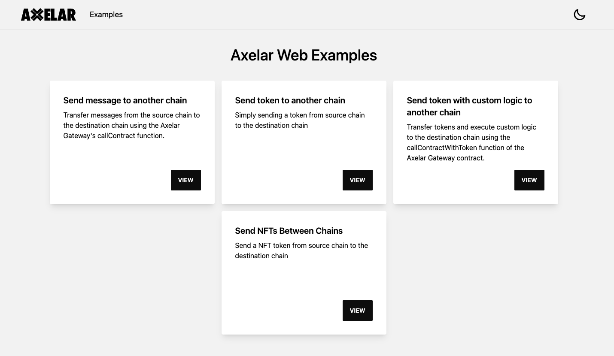

# Web Examples

Discover a comprehensive collection of end-to-end examples in the `examples-web` section. Conveniently, all of the examples have been packaged together, making it simple to set up and run them all in one place.

## Prerequisite

Before you begin, make sure you've set up your environment variables at the root directory. See [here](../README.md#set-environment-variables) for instructions.

## Run Web Examples Locally

1. Navigate to the root directory.
2. Run `npm run start` to start the local chains.
3. Navigate to the `examples-web` directory.
4. Run `npm ci` to install dependencies.
5. Run `npm run setup` to copies the private key and mnemonic from the `.env` file at the root directory to the `.env` file in the `examples-web` directory.
6. Run `npm run deploy` to compile all smart contracts, generate types for smart contract functions, and deploy to the local network.
7. Run `npm run dev` to start the web application server.
8. Open http://localhost:3000 in your web browser to view the examples demo.

You should see the website looks like image below.

